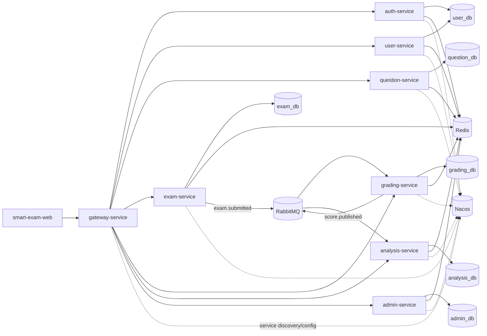

# Smart Exam Cloud 架构设计文档

## 1. 文档目的

本文定义系统技术架构、模块边界、数据与事件契约、运行配置和演进路线，作为开发与运维的统一技术基线。

## 2. 技术栈与分层

后端：

- Java 17
- Spring Boot 3.2.5
- Spring Cloud 2023.0.1
- Spring Cloud Alibaba 2023.0.1.0
- MyBatis-Plus 3.5.7
- MySQL 8.0
- Redis 7
- RabbitMQ 3.x
- Nacos 2.3.2

前端：

- Vue 3
- Vite
- Element Plus
- Axios
- ECharts

## 3. 系统架构总览

## 4. 模块职责与边界

### 4.1 gateway-service

- 统一入口与路由分发。
- JWT 校验，透传 `X-User-Id` 与 `X-Role`。
- 白名单放行：`/api/v1/auth/login`、`/actuator`。

### 4.2 auth-service

- 登录认证与 token 签发。
- 演示账号自动补齐能力。
- 登录短时防重与用户缓存。

### 4.3 user-service

- 用户信息查询（当前用户、详情、列表）。
- 用户缓存加速。

### 4.4 question-service

- 题目与试卷管理。
- 创建接口幂等防重。
- 题库详情/列表缓存。

### 4.5 exam-service

- 考试定义管理。
- 会话生命周期管理。
- 作答保存与提交。
- 考试状态自动流转调度（`NOT_STARTED -> RUNNING -> FINISHED`）。
- 发布交卷事件。

### 4.6 grading-service

- 消费交卷事件并生成任务。
- 基于标准答案执行客观题自动判分（`SINGLE/MULTI/JUDGE/FILL`）。
- 当前实现通过 MySQL 跨 schema 只读查询 `exam_db/question_db` 完成判题数据组装。
- 人工评分流程。
- 发布包含每题得分明细的成绩事件。

### 4.7 analysis-service

- 消费成绩事件并沉淀快照。
- 报表服务（分数分布、基于真实判分聚合的 TopN）。
- 报表缓存与失效。

### 4.8 admin-service

- 管理员域统一入口：用户治理、角色权限、系统配置、审计检索。
- 维护角色-权限矩阵（`sys_role`、`sys_permission`、`sys_role_permission`）。
- 记录高风险操作审计日志（`sys_audit_log`）。
- 提供运营总览聚合指标与短 TTL 缓存。

### 4.9 common 模块

- `common-core`：统一响应、错误码、雪花 ID、事件模型。
- `common-web`：全局异常处理。
- `common-security`：JWT 工具与自动装配。

## 5. API 与网关路由

网关路由映射：

- `/api/v1/auth/**` -> `auth-service`
- `/api/v1/users/**` -> `user-service`
- `/api/v1/questions/**`、`/api/v1/papers/**` -> `question-service`
- `/api/v1/exams/**`、`/api/v1/sessions/**` -> `exam-service`
- `/api/v1/grading/**` -> `grading-service`
- `/api/v1/reports/**` -> `analysis-service`
- `/api/v1/admin/**` -> `admin-service`

响应统一格式：

- 成功：`ApiResponse{code=0,message="OK",data=...}`
- 失败：`ApiResponse{code!=0,message=...,data=null}`

## 6. 数据架构

数据库拆分：

- `user_db`：`sys_user`
- `question_db`：`q_question`、`q_paper`、`q_paper_question`
- `exam_db`：`e_exam`、`e_exam_session`、`e_answer`
- `grading_db`：`g_grading_task`、`g_question_score`
- `analysis_db`：`a_score`、`a_session_question_score`
- `admin_db`：`sys_role`、`sys_permission`、`sys_role_permission`、`sys_audit_log`、`sys_config`

关键约束：

- `q_paper_question(paper_id, order_no)` 唯一。
- `e_answer(session_id, question_id)` 唯一。
- `g_grading_task(session_id)` 唯一。
- `a_score(session_id)` 唯一。
- `a_session_question_score(session_id, question_id)` 唯一。
- `sys_role(role_code)` 唯一。
- `sys_permission(permission_code)` 唯一。
- `sys_role_permission(role_code, permission_code)` 唯一。

设计原则：

- 按业务域拆库，降低耦合。
- 读写热点通过 Redis 吸收。
- 依靠唯一约束和幂等键兜底异步重复消费。

## 7. 缓存、幂等与并发控制

Redis 主要用途：

- 防重幂等键。
- 详情与列表缓存。
- 报表缓存。
- 管理员概览/权限矩阵缓存。

典型策略：

- 登录防重：3 秒窗口。
- 题目/试卷创建防重：8 秒窗口。
- 考试创建防重：5 秒窗口。
- 交卷锁：30 秒窗口。
- 人工评分防重：8 秒窗口。
- 事件去重：7 天窗口。
- 管理员变更操作防重：5 秒窗口。

并发策略：

- 数据库唯一键约束作为最终兜底。
- 会话归属校验防止越权修改。

## 8. 事件驱动架构

消息中间件：

- Exchange：`exam.exchange`（Topic）
- RoutingKey：`exam.submitted`、`score.published`
- Queue：
  - `exam.submitted.q`、`exam.submitted.retry.q`、`exam.submitted.dlq.q`
  - `score.published.q`、`score.published.retry.q`、`score.published.dlq.q`

事件契约：

- `ExamSubmittedEvent`：`eventId`、`examId`、`sessionId`、`userId`、`submittedAt`
- `ScorePublishedEvent`：`eventId`、`examId`、`sessionId`、`userId`、`totalScore`、`publishedAt`、`questionScores[]`
  - `questionScores[]` 字段：`questionId`、`maxScore`、`gotScore`、`objective`

一致性说明：

- 发布端启用 `publisher-confirm-type=correlated` 与 `publisher-returns=true`，支持发布确认与路由失败回调。
- 消费端启用手动 ACK，失败后进入重试队列（TTL 回流主队列），超过重试上限转入 DLQ。
- 消费端通过 Redis 去重和 DB 唯一约束保障幂等，分析侧按 `sessionId` Upsert 满足最终一致。

## 9. 配置中心与环境管理

配置来源：

- 本地 `application.yml` + Nacos 远端配置。

加载策略：

- 每个服务默认加载：
  - `common.yaml`
  - `${spring.application.name}.yaml`

默认连接地址（可通过环境变量覆盖）：

- Nacos：`NACOS_SERVER_ADDR`
- MySQL：`MYSQL_URL` / 用户密码
- Redis：`REDIS_HOST`、`REDIS_PORT`
- RabbitMQ：`RABBITMQ_HOST`、`RABBITMQ_PORT`

## 10. 安全架构

鉴权：

- 网关统一 JWT 校验。
- 下游服务依赖头透传识别用户身份。

风险：

- 认证服务当前兼容历史明文密码并在登录时迁移为 BCrypt，仍需完成全量离线迁移与强策略校验。
- 管理员服务已落地角色权限矩阵，但业务服务侧细粒度权限校验仍需补齐。

建议：

- 引入 BCrypt/Argon2。
- 增加接口级 RBAC 校验与审计。
- 将 JWT Secret 与中间件凭据迁移到安全配置管理。

## 11. 可观测性与运维

可观测能力：

- 各服务开放 `actuator` 健康检查与基础信息端点。
- 关键异常与降级路径日志化。

运维建议：

- 统一日志采集与链路追踪（例如 ELK + OpenTelemetry）。
- 对 MQ 堆积、消费失败、重试情况建立告警。
- 对 Redis 命中率和关键幂等键冲突率建立监控面板。

## 12. 运行与部署约束

本地开发：

- 使用 `docker-compose.yml` 启动中间件。
- 数据库脚本需手动执行（当前 compose 未挂载 SQL 初始化目录）。

部署建议：

- 中间件与业务服务分层部署。
- Nacos 使用独立持久化与备份策略。
- RabbitMQ 可靠队列（主队列/重试队列/DLQ）需在各环境保持一致参数。

## 13. 当前技术债与演进路线

P0：

- 密码哈希化与认证安全加固。
- MQ 可靠投递与消费失败补偿机制（重试与 DLQ）[已完成，2026-03-04]。
- 管理员中心（用户治理、角色权限、系统配置、审计日志）[已完成，2026-03-04]。
- 网关之外的服务级权限校验补齐（除 admin-service 外）。

P1：

- 考试状态自动调度。[已完成，2026-03-04]
- 真正题目正确率统计链路。[已完成，2026-03-04]
- 自动判题规则引擎化。

P2：

- 全链路压测与容量规划。
- 完整自动化测试体系与契约测试平台化。

## 14. 关联文档

- 产品需求文档：`docs/PRD.md`
- 开发与联调手册：`docs/DEVELOPMENT.md`
- SQL 初始化：`docs/sql/01_init_databases.sql`、`docs/sql/02_core_tables.sql`
- Nacos 配置模板：`docs/nacos/`
