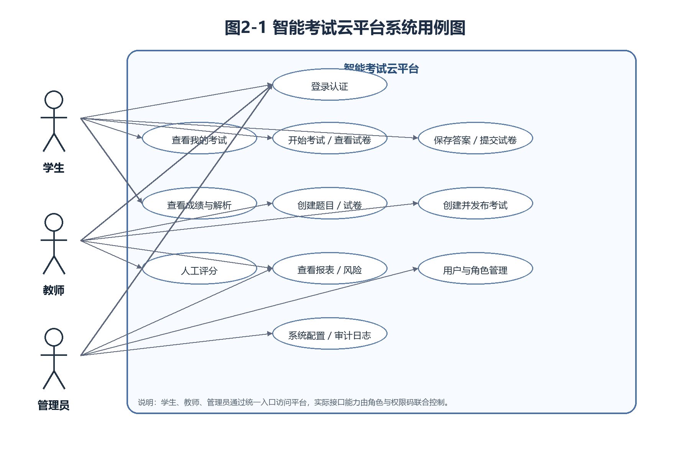
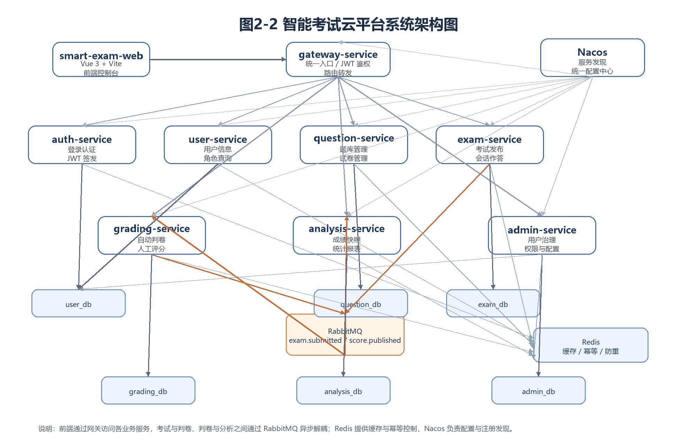

# 摘要

智能考试云平台面向高校课程考试、在线测评、培训考核等场景，目标是构建一套覆盖题库建设、组卷发布、在线作答、自动判卷、人工评分、成绩发布与统计分析的完整考试业务系统。项目采用前后端分离与微服务架构，后端以 Java 17、Spring Boot、Spring Cloud Alibaba 为核心技术栈，前端采用 Vue 3 + Vite，并结合 MySQL、Redis、RabbitMQ、Nacos 实现数据持久化、缓存加速、异步解耦与统一配置管理。

本文档围绕需求分析阶段展开，首先说明项目提出的背景、国内外在线考试系统的发展现状及本项目的研究意义；然后从经济、社会、技术三个维度对系统可行性进行分析；在此基础上，结合学生、教师、管理员三类核心角色，梳理系统业务流程、功能需求与非功能需求。分析结果表明，智能考试云平台在现有教学数字化背景下具备明确的业务价值，技术方案成熟，落地路径清晰，能够满足在线考试业务对安全性、稳定性、可扩展性和可维护性的综合要求。

关键词：智能考试云平台；在线考试；微服务；自动判卷；成绩分析

# ABSTRACT

Smart Exam Cloud is designed for university examinations, online assessments, and training evaluations. Its goal is to provide a complete examination platform covering question bank management, paper composition, exam publishing, online answering, automatic grading, manual scoring, score release, and statistical analysis. The project adopts a front-end and back-end separation mode with a microservice architecture. The back-end is built with Java 17, Spring Boot, and Spring Cloud Alibaba, while the front-end is implemented with Vue 3 and Vite. MySQL, Redis, RabbitMQ, and Nacos are used for persistence, caching, asynchronous decoupling, and centralized configuration.

This document focuses on the requirement analysis stage. It first introduces the project background, the development status of online examination systems at home and abroad, and the significance of this project. Then it evaluates the feasibility of the system from economic, social, and technical perspectives. Based on the needs of three core roles, namely students, teachers, and administrators, the document further analyzes business processes, functional requirements, and non-functional requirements. The analysis shows that Smart Exam Cloud has clear business value in the context of educational digitalization, relies on mature technical solutions, and provides a practical implementation path to satisfy the requirements of security, stability, scalability, and maintainability.

KEYWORDS: Smart Exam Cloud; Online Examination; Microservices; Automatic Grading; Score Analysis

# 1 绪论

## 1.1 问题的提出

传统考试管理通常依赖人工组织和线下流程，存在题库分散、组卷效率低、阅卷周期长、成绩反馈慢、统计分析不足等问题。当考试规模扩大或教学场景从线下转向线上时，这些问题会进一步放大，容易导致教师工作量增加、学生体验下降以及管理过程缺乏统一标准。

随着高校教学信息化、职业教育数字化和远程培训常态化发展，考试系统不再只是简单的答题工具，而是需要承担统一认证、权限控制、考试过程管理、自动判卷、结果追踪、风险识别和运营管理等职责。因此，有必要建设一套可扩展、可持续演进的智能考试云平台，以支撑完整的考试业务闭环。

## 1.2 选题背景

近年来，教育行业和培训行业不断推进数字化转型，在线教学、混合式教学、远程考试等场景快速普及。相较于单体式或临时拼接的考试系统，现代在线考试平台需要同时解决以下问题：

- 多角色协同问题，包括学生、教师、管理员的权限隔离与流程协作。
- 高并发和稳定性问题，包括考试集中开考、集中交卷、集中查分等高峰场景。
- 数据一致性问题，包括交卷、判卷、成绩发布和报表更新之间的状态一致。
- 运营与治理问题，包括角色权限管理、系统配置管理、日志审计与风险控制。

本项目在此背景下提出，尝试使用微服务架构搭建一套面向真实业务场景的智能考试云平台，为后续进一步扩展自动判题规则、防作弊能力和更细粒度权限体系打下基础。

## 1.3 国内外研究现状

### 1.3.1 国内研究现状

国内在线考试系统已经在高校教务、职业资格培训、企业内训等领域得到广泛应用。当前多数系统已经具备题库管理、组卷、考试发布、自动判分和成绩统计等基本能力，但仍存在以下共性问题：

- 许多系统仍以单体架构为主，模块耦合较高，难以支撑持续扩展。
- 权限管理通常停留在角色级别，缺少接口级细粒度控制和统一治理能力。
- 部分系统更关注功能实现，对幂等、防重、消息一致性、审计追踪等工程能力覆盖不足。
- 成绩分析与考试过程风险监控功能相对薄弱，难以满足数据驱动教学评价的需求。

因此，面向云化、服务化和平台化演进的在线考试系统，已成为当前国内相关系统建设的重要方向。

### 1.3.2 国外研究现状

国外在在线学习与在线测评领域起步较早，围绕学习管理系统、在线作业系统、考试平台和远程监考平台形成了较成熟的产品体系。典型平台通常具有以下特点：

- 题库管理、课程管理、测评管理和成绩反馈深度集成。
- 更重视系统扩展性、跨系统集成能力与标准化接口。
- 在无障碍支持、数据隐私、考试公平性和远程监考方面投入较多。
- 更强调基于数据分析的学习效果评估与教学改进。

总体来看，国外系统在平台化和产品化方面较成熟，而国内系统在本地化业务适配和部署灵活性方面更有优势。本项目借鉴成熟系统的设计思路，同时结合本地教育场景对权限、安全、部署和扩展的实际需求进行建设。

## 1.4 本项目研究的意义

智能考试云平台的研究和实现具有以下意义：

- 有助于提升考试组织效率，减少人工组卷、人工汇总和人工统计成本。
- 有助于提高成绩反馈及时性，使教师能够更快获得考试结果与分析数据。
- 有助于规范在线考试流程，通过统一认证、权限控制、日志审计和风险识别提升管理水平。
- 有助于支持教学评价数字化，通过成绩分布、题目正确率、成绩单等报表为教学改进提供依据。
- 有助于构建可扩展平台，为后续引入更智能的判题引擎、防作弊策略和多终端考试能力预留空间。

# 2 系统需求分析

## 2.1 可行性分析

### 2.1.1 经济

从经济角度看，本项目具有较高的可行性。首先，系统核心技术栈主要采用开源方案，包括 Java、Spring Boot、Spring Cloud Alibaba、Vue 3、MySQL、Redis、RabbitMQ 和 Nacos，不依赖高额商业授权软件，能够有效降低研发和部署成本。其次，系统采用前后端分离和微服务设计，可以根据实际业务量分阶段部署，前期能够在普通开发服务器或容器环境中运行，硬件投入可控。

从长期收益看，平台上线后能够在以下方面降低运营成本：

- 降低教师在题库维护、组卷、阅卷和成绩统计上的重复劳动。
- 缩短考试组织周期和结果反馈周期，提高教学管理效率。
- 降低因人工操作产生的错漏和重复统计问题。
- 为后续多课程、多学院、多批次考试复用提供平台化基础。

因此，从投入与产出角度分析，项目具备较好的经济可行性。

### 2.1.2 社会

从社会和应用价值角度看，本项目同样具有可行性。在线考试系统能够适应当前教育数字化、教学线上线下融合和培训业务远程化的发展趋势。平台不仅服务于考试组织，还能够提升考试过程透明度、成绩反馈及时性和教学评价数据化水平。

系统的社会价值主要体现在以下方面：

- 为学校、培训机构等场景提供标准化、规范化的考试流程支撑。
- 方便学生在统一平台完成考试、查分和查看解析，提升使用体验。
- 帮助教师快速完成考试管理与成绩分析，提升教学反馈效率。
- 帮助管理人员进行用户治理、权限维护和日志审计，增强平台治理能力。

因此，该项目符合教育信息化发展方向，具备较好的社会可接受性和推广意义。

### 2.1.3 技术

从技术层面看，本项目采用的技术方案成熟，且项目当前已经具备较完整的实现基础。系统采用基于 Spring Boot 和 Spring Cloud 风格的微服务架构，后端拆分为网关、认证、用户、题库、考试、判卷、分析、管理等多个服务，配合 Redis 实现缓存和幂等控制，配合 RabbitMQ 实现交卷到判卷、判卷到分析的异步事件链路，配合 Nacos 实现服务发现和统一配置管理。

现有工程已经完成以下核心能力：

- 登录认证与 JWT 鉴权。
- 用户信息查询与角色权限控制。
- 题库、试卷、考试、作答、交卷等主业务流程。
- 客观题自动判分与主观题人工评分。
- 成绩发布、成绩解析、分布报表和成绩单统计。
- 管理员中心的用户、角色、权限、系统配置和审计功能。

同时，项目也明确存在一些后续优化点，例如自动化测试体系仍需完善、全链路审计仍待加强、完整防作弊能力尚在演进、自动判题规则引擎化尚未完成。这些问题并不影响系统整体方案的成立，但需要在后续迭代中持续补齐。综合判断，项目具有较强的技术可行性。

## 2.2 系统业务分析

### 2.2.1 用户需求

本系统面向三类核心角色：学生、教师和管理员，不同角色对应不同业务诉求。

学生侧的主要需求包括：

- 通过统一入口登录系统并保持会话状态。
- 查看分配给自己的考试列表和考试状态。
- 在规定时间内开始考试、查看题面、保存答案和提交试卷。
- 在系统允许的条件下查看成绩、题目得分、标准答案和解析。

教师侧的主要需求包括：

- 创建题目并维护题库内容。
- 基于题库进行组卷，并设置试卷结构和分值。
- 创建考试、配置开始结束时间并指定参与学生。
- 在考试结束后对主观题进行人工评分。
- 查看考试成绩单、分数分布和题目正确率等统计结果。
- 查看考试风险信息，并按需提前发布成绩解析。

管理员侧的主要需求包括：

- 管理用户账号、启停状态和角色分配。
- 维护角色权限矩阵，统一治理平台访问边界。
- 管理系统配置项，支撑平台运行参数调整。
- 查询审计日志和平台概览数据，满足治理和运维需求。

### 2.2.2 系统需求

结合三类角色需求，系统需要满足以下总体要求：

- 提供统一认证入口，并对所有核心业务接口进行访问控制。
- 支持题目、试卷、考试、作答、判卷、报表的完整业务闭环。
- 支持考试高峰期的并发访问，避免重复提交、重复创建和重复消费。
- 保证交卷、判卷、成绩发布、报表更新之间的数据一致性和可追踪性。
- 支持多角色、多服务协同，保证权限边界清晰。
- 支持平台化治理能力，包括配置管理、用户治理、角色授权和审计日志。
- 支持后续扩展更复杂的题型、更完整的防作弊策略和更智能的判题能力。

## 2.3 系统功能需求分析

### 2.3.1 系统用例图示

结合当前系统设计，主要参与者与核心用例如下：

- 学生：登录系统、查看我的考试、开始考试、保存答案、提交试卷、查看成绩与解析、查看风险结果。
- 教师：登录系统、创建题目、管理试卷、创建考试、查看考试风险、人工评分、发布成绩解析、查看统计报表。
- 管理员：登录系统、管理用户、维护角色权限、维护系统配置、查询审计日志、查看平台总览。

从业务关系上看，学生主要围绕“参加考试”展开，教师主要围绕“组织考试与教学评价”展开，管理员主要围绕“平台治理与运维管理”展开。三类角色通过统一网关接入系统，但在服务侧依据角色和权限码进行访问隔离。

### 2.3.2 登录与认证模块

系统需要支持用户名密码登录，并在登录成功后签发 JWT 令牌。登录响应应包含用户基础信息、角色信息和权限码集合，以便前端在页面级和接口级进行能力控制。系统还应提供注销接口，用于清理客户端登录态。

在安全控制方面，登录接口需要具备短时间窗口防重能力，避免用户因重复点击导致重复提交；网关层对非白名单路径统一校验 Bearer Token，并将用户身份信息透传给下游服务。未通过认证的请求应返回统一错误结构。

### 2.3.3 用户与权限模块

系统需要支持当前用户信息查询、指定用户详情查询和用户列表查询，以满足前端展示和管理需要。管理员还需要能够对用户状态、用户角色和用户密码进行维护。

在权限设计上，系统需要实现接口级角色与权限码控制。管理员域负责维护角色权限矩阵，业务服务依据透传的 `X-User-Id`、`X-Role`、`X-Permissions` 进行访问控制，从而保证教师只能管理自己的题库和考试，学生只能访问自己的考试数据，管理员具备平台治理能力。

### 2.3.4 题库与试卷模块

题库模块需要支持题目创建、题目列表查询、题目详情查询等能力，并覆盖单选题、多选题、判断题、填空题和简答题等题型。教师创建题目时必须填写题型、难度、标准答案、选项和解析等核心信息，系统需校验数据格式合法性。

试卷模块需要支持试卷创建、试卷查询和试卷详情展示。组卷时系统需要校验题目是否存在、题目不可重复、题型顺序是否合法，并根据题目分值自动计算试卷总分。题库与试卷数据应按教师进行隔离，管理员可进行全量查看。

### 2.3.5 考试发布与作答模块

考试模块需要支持教师创建考试、设置开始时间和结束时间、绑定试卷并指定学生名单。学生只能查看被分配给自己的考试，不能通过手工输入考试编号访问无权考试。

学生开始考试后，系统应创建或复用对应会话，并提供试卷题面查询、历史答案回填、答案保存和试卷提交能力。系统必须保证同一学生同一考试只能存在一个有效会话；考试结束后若学生仍未交卷，系统需要自动将会话转为强制提交状态并进入后续判卷流程。

### 2.3.6 判卷与成绩发布模块

判卷模块需要在消费交卷事件后自动创建判卷任务，对单选、多选、判断和填空题进行自动判分，对简答题生成待人工评分任务。教师需要能够按任务状态查询待处理任务，并提交人工评分结果。

判卷完成后，系统需要发布成绩事件并支持成绩解析开放控制。默认情况下，考试结束后学生可查看标准答案与解析；若考试尚未结束，则需要由教师显式发布，系统才可向学生返回完整解析内容。

### 2.3.7 成绩查询与解析模块

学生需要能够基于自己的会话查询成绩摘要，包括总分、每题得分、作答结果等信息。若当前不满足解析开放条件，系统应仅返回摘要信息与提示信息，不应直接暴露标准答案和题目解析。

教师需要能够按考试维度查看成绩单，并按学生姓名、用户名或学号等关键字进行筛选；同时，系统需要支持按考试维度维护成绩解析开放状态，以便满足不同教学节奏下的业务要求。

### 2.3.8 分析报表模块

分析模块需要在成绩发布后沉淀报表快照，向教师提供分数分布报表、成绩单报表以及题目正确率 TopN 报表。相关统计结果应基于真实判分结果生成，而不是基于前端临时计算。

由于报表查询可能在短时间内被频繁访问，系统需要为报表接口提供缓存能力，并在成绩更新后自动失效，以兼顾查询性能和结果准确性。

### 2.3.9 管理员中心模块

管理员中心需要提供平台总览、用户管理、角色权限管理、系统配置管理和审计日志查询等功能。其中，用户管理应支持分页查询、状态修改、角色修改和密码重置；角色权限管理应支持权限矩阵维护；系统配置管理应支持读取和修改平台运行参数。

对涉及高风险或关键影响的管理员操作，系统需要记录审计日志，便于后续追踪责任、复盘操作过程并支撑平台治理。

### 2.3.10 防作弊模块

考试模块需要支持考试过程中的防作弊事件采集，例如页面切换、异常行为上报等。系统需根据采集到的事件信息聚合形成会话风险摘要，并按风险等级输出结果，供教师或管理员查看。

考虑到不同考试场景对风险控制的要求不同，系统还需要支持防作弊规则参数配置化，使风险阈值、评分参数和查询限制能够通过配置中心统一管理。

### 2.3.11 前端控制台模块

前端系统需要提供登录能力、令牌持久化、接口地址切换、角色化功能入口以及各业务模块页面。学生端重点支撑在线作答、答案回填、自动保存提示和成绩解析查看；教师端重点支撑题库维护、考试管理、阅卷和报表查看；管理员端重点支撑平台治理。

前端还需要与后端统一响应结构配合，正确处理鉴权失败、参数校验失败、权限不足等异常情况，并在图表展示、表格查询和详情跳转等交互上保持一致性。

### 2.3.12 系统架构图

系统采用前后端分离与微服务架构。前端控制台通过网关统一接入后端服务，核心业务服务按认证、用户、题库、考试、判卷、分析、管理员治理等领域拆分。考试、判卷和分析之间通过消息队列实现异步解耦，Redis 提供缓存和幂等控制，Nacos 提供服务注册发现和配置中心能力。系统整体架构如图 2-2 所示。

## 2.4 非功能需求分析

### 2.4.1 性能

系统在性能方面需要满足以下要求：

- 能够支撑考试高峰期集中登录、集中开考、集中保存答案和集中交卷场景。
- 对热点查询接口提供缓存，降低数据库压力。
- 对创建、提交、评分等关键写操作提供幂等和防重能力，避免重复请求造成数据异常。
- 对异步消息消费提供重试和死信处理机制，提升链路稳定性。

从当前实现看，系统已经通过 Redis、消息队列、唯一约束和幂等键等机制为高并发场景提供了基础保障。

### 2.4.2 环境

系统运行环境需要满足以下基本条件：

- 服务端开发与运行环境：JDK 17、Maven 3.9 及以上。
- 中间件环境：MySQL 8.0、Redis 7、RabbitMQ 3.x、Nacos 2.x。
- 前端运行环境：Node.js、npm、现代浏览器。
- 部署环境：支持 Docker / Docker Compose，便于本地联调和后续部署。

此外，系统需要通过统一配置中心管理环境差异，支持在开发、测试和部署阶段以较低成本完成配置切换。

### 2.4.3 安全性

系统在安全方面需要保证：

- 未登录用户不能访问核心业务接口。
- 登录认证信息不能以明文形式长期保存和传输。
- 不同角色之间的业务数据必须隔离，避免越权访问。
- 关键管理操作可追踪、可审计。

当前系统已具备 JWT 鉴权、BCrypt 密码策略、接口级 RBAC、管理员审计日志等基础能力，为后续进一步加强安全治理提供了支撑。

### 2.4.4 可维护性与可扩展性

系统采用微服务架构和公共模块抽取方式，具备较好的可维护性。不同业务域通过独立服务进行拆分，服务之间职责边界清晰，便于独立开发、测试和演进。公共能力则沉淀在 `common-core`、`common-web`、`common-security` 等模块中，降低了重复实现成本。

在扩展性方面，系统为自动判题规则引擎、更复杂的防作弊能力、更精细的权限模型和更完善的自动化测试体系预留了演进空间，满足后续持续迭代需求。

## 2.5 本章小结

本章围绕智能考试云平台的需求展开分析，从可行性、业务对象、功能模块和非功能约束多个维度进行了系统梳理。通过分析可以看出，平台围绕学生、教师、管理员三类角色形成了较完整的业务闭环，功能目标明确，技术路径清晰，具备较强的落地条件。后续在系统设计与实现阶段，可继续围绕当前需求分析结果细化接口设计、数据库设计、页面设计与测试方案。
